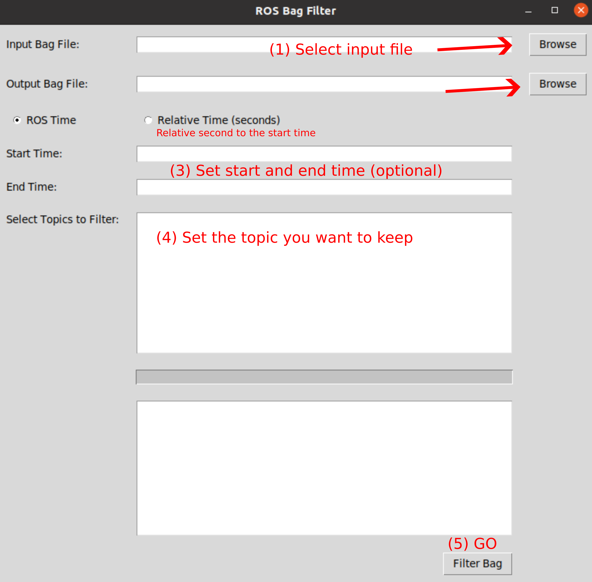

# ROS Bag Filter App

This Python script provides a graphical user interface (GUI) application for filtering ROS bag files using `tkinter`. It allows users to easily specify input and output bag files, configure time modes, and filter topics based on time intervals. With this tool, working with ROS bag files becomes more intuitive, eliminating the need to use the command line.

## Features
- **Input and Output Bag File Selection**: Easily browse and select your input and output ROS bag files.
- **Time Mode Selection**: Choose between ROS time and relative time modes for precise filtering.
- **Topic Filtering**: Filter specific topics from the ROS bag file with ease.
- **Time Interval Filtering**: Filter messages based on a defined time range.
- **User-Friendly GUI**: Intuitive interface built with `tkinter` for a smooth user experience.

## Usage

### 1) Use the Pre-Built, Dependency-Free App (Tested on Ubuntu 20.04)
Download and run the app directly from the release page:
```bash
# Install curl if not already installed
sudo apt-get install curl 

# Download the app
curl -L -o rosbag_filter_app https://github.com/RENyunfan/rosbag_filter_app/releases/download/v0.1/rosbag_filter_app

# Make the app executable
sudo chmod +x rosbag_filter_app

# Run the app
./rosbag_filter_app
```

### 2) Run the Source Code
If you prefer to run the source code directly:
```bash
# Install necessary dependencies
sudo apt-get install python3-tk
pip3 install bagpy

# Run the application
python3 rosbag_filter_app.py
```

## Using the GUI



1. **Select Input Bag File**: Click 'Browse' and choose the input bag file.
2. **Select Output Bag File**: Click 'Browse' and specify the path for the output bag file.
3. **Choose Time Mode**: Select between ROS time and relative time.
   - **ROS Time Mode**: Input the UTC time.
   - **Relative Time Mode**: Input the time in seconds relative to the start time.
4. **Filter Topics**: Select the topics you wish to filter or retain.
5. **Specify Time Interval**: Define the start and end times for filtering.
6. **Start Filtering**: Click 'Start' to begin the filtering process. The filtered bag file will be saved to the specified output location.

## Contributing
We welcome contributions! If you'd like to contribute, please fork the repository and submit a pull request with your proposed changes.

## License
This project is licensed under the MIT License
